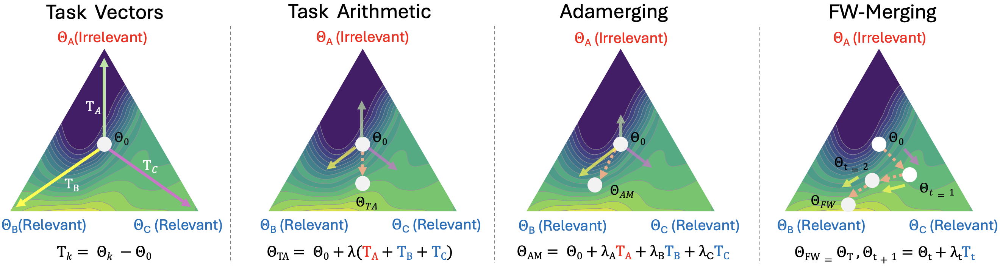
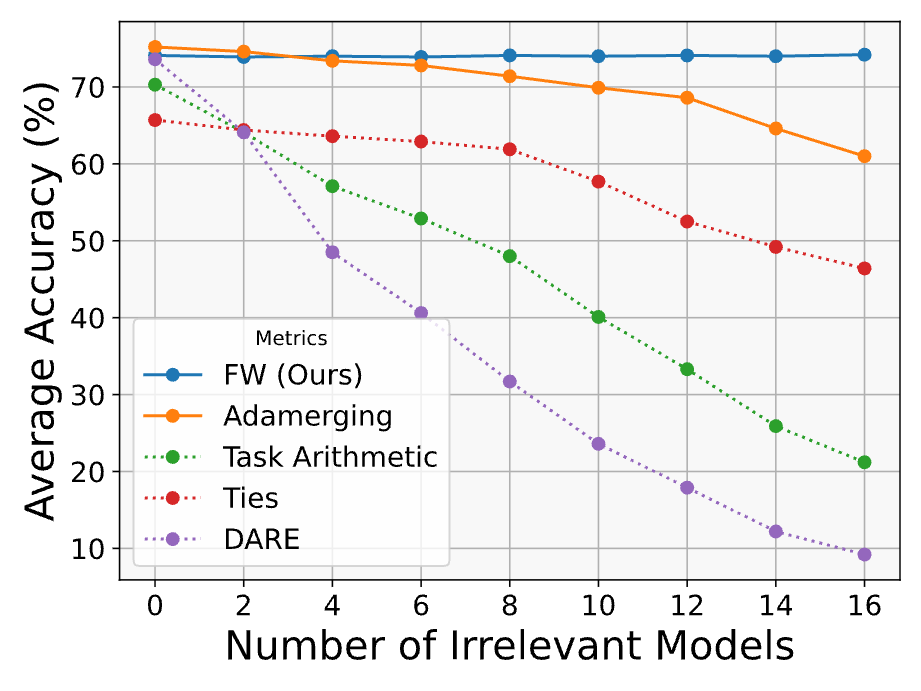
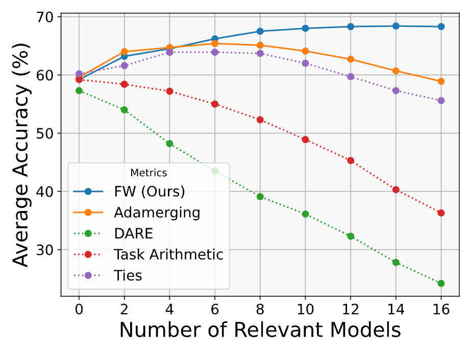
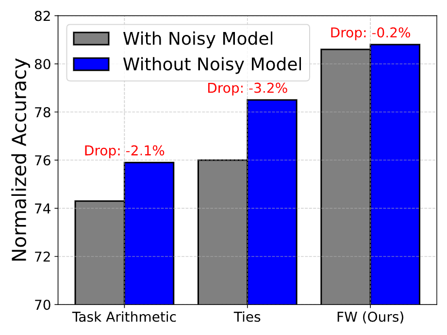

# FW-Merging

This repository provides the official implementation of [**Frank-Wolfe Merging**](https://arxiv.org/abs/2503.12649) **(FW-Merging)**, a method that frames large-scale model merging as a constrained optimization problem. Fine-tuned checkpoints define the constraint set, while the objective dictates the desired properties of the merged model.  

Inspired by Frank-Wolfe optimization, FW-Merging contains three key stages:  

1. **Relevance Evaluation** – Uses gradient-based linear approximation to identify the most beneficial merging direction.  
2. **Model Selection** – Selects checkpoints that minimize interference while preserving task-specific knowledge.  
3. **Knowledge Integration** – Merges the selected checkpoint using an orthogonal method, balancing adaptation and stability.   



FW-Merging is designed to satisfy two fundamental scaling properties of model merging: (1) **Irrelevance Robustness** – Adding irrelevant models to the merging pool should not degrade performance. (2) **Relevance Utilization** – Adding relevant models should steadily improve performance, converging toward the optimal outcome.  

Our experiments show that FW-Merging remains stable with **16 irrelevant models**, improves by **15.3%** with **16 relevant models** on **20 CV tasks**, and maintains constant memory overhead—unlike data-informed methods with linear overhead. It outperforms data-free merging by **32.8%** and data-driven merging by **8.39%** when merging **20 ViT models**.  


<div style="display: flex; justify-content: space-around;">
    
    
    
</div>

## BibTeX

```
@misc{chen2025fwmergingscalingmodelmerging,
      title={FW-Merging: Scaling Model Merging with Frank-Wolfe Optimization}, 
      author={Hao Mark Chen and Shell Xu Hu and Wayne Luk and Timothy Hospedales and Hongxiang Fan},
      year={2025},
      eprint={2503.12649},
      archivePrefix={arXiv},
      primaryClass={cs.LG},
      url={https://arxiv.org/abs/2503.12649}, 
}
```

## Contents

- [Installation](#installation)
- [Merging for Discriminative Models](#merging-for-discriminative-models)
- [Merging for Generative Models](#merging-for-generative-models)
- [Merging for Vision Models](#merging-for-vision-models)
- [Acknowledgments](#acknowledgments)

## Installation 

Create conda env:

```conda env create -n FW-merging``` 

After activating the conda environment, install the requirements (might need to install torch==2.0.1 first)

```pip install -r requirements```

Then install the rest of dependency from yml file

```conda env update -f env.yml```

## Merging for Discriminative Models

### Checkpoints

The merged model checkpoint can be found at [here](https://huggingface.co/hmarkc/FW-merged/tree/main/roberta).

### Run Merging

Download the 4 Roberta models as specified in Twin Merging repo.

```huggingface-cli download lu-vae/roberta-glue --local-dir roberta```

Then run the scripts

```cd discriminative; source scripts```

To run model merging with FW and evlauation, run the following command in terminal 

```run_frank_wolfe```

The results will be saved under ```outs``` directory.

## Merging for Generative Models

### Checkpoints

The merged model checkpoint can be found at [here](https://huggingface.co/hmarkc/FW-merged/tree/main/llama).

### Run Merging

Download the 16 LLaMA2-7B models as specified in ```generative/llama.json``` under ```llama``` folder.

Then run the scripts

```cd generative; source scripts```

To run model merging with FW and evlauation, run the following command in terminal 

```run_frank_wolfe```

The models will be saved under ```outs``` directory.

The models can then be evlauated using third-party packages like [lm-eval-harness](https://github.com/EleutherAI/lm-evaluation-harness).

## Merging for Vision Models

Please refer to this [repo](https://github.com/hmarkc/fusion_bench) for the implementation of FW Soft and FW Hard on ViT benchmarks.

## Acknowledgments
The codebase is adapted from [Twin Merging](https://github.com/LZY-the-boys/Twin-Merging?tab=readme-ov-file). We thank the authors for their wonderful work.

